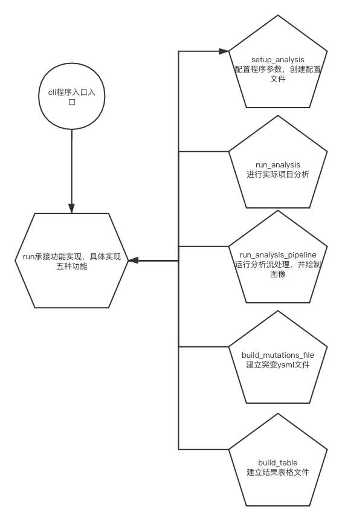

# DataMask
数据隐匿保护系统

## 介绍

该系统主要分为两部分：数据安全处理和数据隐私发布

| 项目名称                         | 实现重点                               |
| -------------------------------- | -------------------------------------- |
| 医疗数据安全处理系统的设计与实现 | 侧重的是数据的处理和分析，及前台的展示 |
| 医疗数据隐私发布系统的设计与实现 | 侧重的是医疗数据的隐私保护与系统设计   |

## 资料

| 名称           | 地址                                                         |
| -------------- | ------------------------------------------------------------ |
| PyClone-paper  | https://www.nature.com/articles/nmeth.2883                   |
| PyClone-代码   | https://github.com/Roth-Lab/pyclone                          |
| SciClone-paper | https://journals.plos.org/ploscompbiol/article?id=10.1371/journal.pcbi.1003665 |
| SciClone-代码  | https://github.com/genome/sciclone                           |

## PyCLone

### Pyclone本体

#### 代码运行

安装conda adaconda和miniconda都可以

安装bioconda。 http://bioconda.github.io/user/install.html

创建环境 conda create -n pyclone -c bioconda -c conda-forge pyclone

激活程序 conda activate pyclone

检查安装 PyClone --help

测试1 直接生成结果 PyClone build_mutations_file --in_flies xxx.tsv --out_file yyy.yaml

测试2 PyClone run_analysis_pipeline --in_files xxx.tsv --working_dir test_dir

代码至此全部成功运行且结果正确

#### 输入格式

使用制表符分隔（tsv）输入文件来使用PyClone，每个文件来自癌症的每个样本。此文件的必填列如下

- variant_id：突变的唯一标识符。跨数据集应该是相同的。
- ref_counts：与参考等位基因匹配的基因座重叠的读段数。
- var_counts：支持突变型（variant allele）的reads数量
- normal_cn：非肿瘤细胞中位点的拷贝数，除Y染色体外，通常为2.
- minor_cn：肿瘤细胞中次等位突变（the minor allele）位点的拷贝数。该列数值需小于major_cn列
- major_cn：肿瘤细胞中主要等位突变（the major allele）位点的拷贝数。 该列数值大于minor_cn列，且大于0

任何其他列都将被忽略。示例文件被发现[这里](https://github.com/Roth-Lab/pyclone/tree/master/examples/mixing/tsv)从原来的PyClone本文所采用的混合数据集。

#### 数据分析方法&结果展示

在一开始加载输入文件名和输出路径名

##### 数据分析

###### cli入口

加载各个模块(解析参数->进行分析->分析管道流->建立突变文件->绘制clusters->绘制loci->建表)

| 名字                                                    | 作用                     | 流程                                                         |
| ------------------------------------------------------- | ------------------------ | ------------------------------------------------------------ |
| _setup_setup_analysis_parser                            | 设置参数                 | 首先确定输入文件，工作路径，肿瘤列表，样本数据，临时配置文件，密度，迭代次数内容，最后运行 |
| _setup_run_analysis_parser                              | 运行分析                 | 加载参数,设随机种子，最后运行parser.set_defaults(func=run.run_analysis)函数处理 |
| _setup_analysis_pipeline_parser                         | 分析管道流               | 加载参数，增加_process参数，设随机种子，读取输出格式(默认pdf，还可以svg)，设最大clusters，mesh大小，最小clusters。最后运行parser.set_defaults(func=run.run_analysis_pipeline) |
| _setup_build_prior_parser                               | yaml格式突变数据用于分析 | 确定输入输出文件，先验参数parser.set_defaults(func=run.build_mutations_file) |
| _setup_cluster_plot_parser </br>_setup_loci_plot_parser | 绘图                     | 加载参数，确定输出参数，run.cluster_plot和run.loci_plot      |
| _setup_build_table_parser                               | 创建表格                 | 加载outfile，table_type，cluster最大值，mesh大小，post处理流程，parser.set_defaults(func=run.build_table) |

---

###### run函数解析

**_setup_analysis**

创建工作路径，yaml文件，对infile的每种参数进行拼接，创建突变文件。最后将参数都写入到config.yaml文件中

**run_analysis** 

加载随机种子，加载配置文件，若配置中'concentration浓度'.'先验'存在则加载，加载num_iters，加载density密度

判断浓度是否为二项式或贝塔二项式，是则加载对应函数，否则raise Exception报错

**run_analysis_pipeline**

加载配置，调用_setup_analysis，加载tables路径且创建文件，对于['cluster', 'loci']进行绘图，

绘图明细

```python
    plots = [
        ('cluster', 'density'),
        ('cluster', 'parallel_coordinates'),
        ('cluster', 'scatter'),
        ('loci', 'density'),
        ('loci', 'parallel_coordinates'),
        ('loci', 'scatter'),
        ('loci', 'similarity_matrix'),
        ('loci', 'vaf_parallel_coordinates'),
        ('loci', 'vaf_scatter')
    ]
```

**build_table**

判断表类型['cluster','loci','lod_style']执行格式转化，变为tsv

df.to_csv(out_file, index=False, sep='\t')

**build_mutations_file**

读取csv文件reader = csv.DictReader(open(in_file), delimiter='\t')

将读取到的ref_counts...major_cn这些参数都提取出来

创建对应路径并打开输出文件文件

yaml.dump(config, fh, Dumper=Dumper)打印文件

最后关闭文件

-----

###### 文件用途

| cli           | 程序入口                                        |
| ------------- | ----------------------------------------------- |
| run           | 承接cli功能实现                                 |
| binomial      | 二项式分析                                      |
| beta_binmmial | 贝塔二项式分析                                  |
| math_uils     | 为二项式提供支持                                |
| multi_sample  | 取样(多样本),允许在PyDP框架中分析多个样本的功能 |
| sampler       | 取样,对详细数据,密度分别取样                    |
| post_process  | 输出流程，绘图和建标都包含于此                  |
| utils         | 创建路径                                        |
| config        | 各种加载文件，获取数据功能                      |
| trace         | 建立数据追踪功能，同读写文件                    |
| paths         | 获取各种数据，路径拼接                          |

##### 输出

###### 图像

输出集中在post_access中

分为polt文件夹 clusters集群 loci基因

后两者会被polt文件夹中的代码调用，最终生成图像

###### 表格

主要通过run.build_table实现

根据['cluster', 'loci', 'lod_style']进行建立表格 

df = post_process.loci.load_table

df.to_csv(out_file, index=False, sep='\t')

#### 数据集样例解读

数据集有标签(AB,BB)

125行9列无缺省字段

| 参数1      | 参数2        | PEARSON相关 |
| ---------- | ------------ | ----------- |
| ref_counts | variant_freq | 0.95        |
| minor_cn   | major_cn     | -1          |

#### 调研机器学习算法实现

待完成

#### 主体代码逻辑结构图



#### 数学模型

二项式分析解读 - run_pyclone_binomial_analysis

在run调用

        run_pyclone_binomial_analysis(
            config_file,
            num_iters,
            alpha,
            alpha_priors
        )
```python
sample_atom_samplers = OrderedDict()
sample_base_measures = OrderedDict()
sample_cluster_densities = OrderedDict()
# 首先建立3个有序字典

base_measure_params = config.load_base_measure_params(config_file) # 加载参数
init_method = config.load_init_method(config_file) # 确定起始方法

for sample_id in sample_ids:
    sample_base_measures[sample_id] = BetaBaseMeasure(base_measure_params['alpha'], base_measure_params['beta'])
    sample_cluster_densities[sample_id] = PyCloneBinomialDensity()
# PyCloneBinomialDensity 在底层有较多log运算
    sample_atom_samplers[sample_id] = BaseMeasureAtomSampler(sample_base_measures[sample_id],                                                        sample_cluster_densities[sample_id])
# 针对每个提取器数据进行提取

base_measure = MultiSampleBaseMeasure(sample_base_measures)
cluster_density = MultiSampleDensity(sample_cluster_densities)
atom_sampler = MultiSampleAtomSampler(base_measure, cluster_density, sample_atom_samplers)
partition_sampler = AuxillaryParameterPartitionSampler(base_measure, cluster_density)
sampler = DirichletProcessSampler(atom_sampler, partition_sampler, alpha, alpha_priors)
trace = DiskTrace(config_file, data.keys(), {'cellular_frequencies': 'x'}) # 可以 open close update
trace.open()
sampler.initialise_partition(data.values(), init_method)
# 初始化各个组件,做运算前最后准备


for i in range(num_iters): # 进行指定次数的迭代
    state = sampler.state
    if i % 100 == 0: # 每100次提醒一次
        print 'Iteration: {}'.format(i)
        print 'Number of clusters: {}'.format(len(np.unique(state['labels'])))
        print 'DP concentration: {}'.format(state['alpha'])
        print
    sampler.interactive_sample(data.values())

'''
pydp-samplers-dp 迭代源码

    def interactive_sample(self, data):
        if self.update_alpha:如果存在阿法则更新
            self.alpha = self.concentration_sampler.sample(self.alpha,
                                                           self.partition.number_of_cells,
                                                           self.partition.number_of_items)
通过
        self.partition_sampler.sample(data, self.partition, self.alpha)

        self.atom_sampler.sample(data, self.partition)

        if self.update_global_params:
            self.global_params_sampler.sample(data, self.partition)
'''
    trace.update(state) # 更新当前状态

trace.close()
```

### 组件 - Pydp

主要用于实现Dirichlet过程混合模型（DPMM），为其提供各种算法纯Python实现	

Roth实验室Pyclone实现主要依赖组件,提供原生安装和conda安装两种方式

#### DPMM介绍

Dirichlet 过程混合模型  狄利克雷过程混合模型（Dirichlet Process Mixture Model) 

一种非参数贝叶斯模型，可以理解为一种聚类方法，但无需指定类别数量，可以从数据中推断簇数量。

此外想系统学习前要理解DP过程及其三中构造方式

（1）Stick-breaking 构造 （2）Polya urn scheme 构造 （3）Chinese restaurant process

###### 通俗理解

假设有一个巨大空间，整个空间包含无数混合组成部分，每次选择其中几个成分，利用这几个成分生成一组数据。我们把多组数据放在一起，就可以得到现在拥有全部数据

DPMM有良好聚类性质，可以实现一组 数据的聚类和分析。但多组数据聚类时，利用Dirichlet过程混合模型无法实现建模分析

下述链接

https://www.datalearner.com/blog/1051471599181249


## 其他操作指引

#### 数据聚类 

暂未分析

**K_means - SciPy 聚类包**。  from scipy.cluster.vq import *

```python
from scipy.cluster.vq import *
from numpy.random import randn
from numpy import array
from numpy import vstack

class1 = 1.5 * randn(100,2)
class2 = randn(100,2) + array([5,5])

features = vstack((class1,class2))
# 上面的代码生成两类二维正态分布数据。用 k=2 对这些数据进行聚类：
centroids,variance = kmeans(features,2)
'''
由于 SciPy 中实现的 K-means 会计算若干次（默认为 20 次），并为我们选择方差最 小的结果，所以这里返回的方差并不是我们真正需要的。现在，你可以用 SciPy 包 中的矢量量化函数对每个数据点进行归类：
'''
code,distance = vq(features,centroids)
# 通过上面得到的 code，我们可以检查是否有归类错误。为了将其可视化，我们可以 画出这些数据点及最终的聚类中心

figure() ndx = where(code==0)[0]

plot(features[ndx,0],features[ndx,1],'*') ndx = where(code==1)[0] plot(features[ndx,0],features[ndx,1],'r.')

plot(centroids[:,0],centroids[:,1],'go') axis('off')

show()
```

